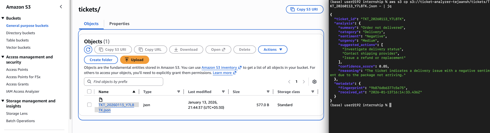

# Ticket Intelligence


AI-powered ticket summarization and tagging that actually understands what customers are saying.

I built this because I was tired of watching support teams drown in tickets while valuable insights slipped through the cracks. This system intercepts incoming support requests, analyzes them with GPT-4o-mini, and returns structured intelligence—categorization, sentiment, urgency levels, and actionable recommendations—all in under 2 seconds.

## The Problem  

Support tickets are an invaluable gauge of customer sentiment, yet they are often underutilized. When teams focus solely on repetitive inquiries, high-stakes issues can easily be overlooked or misclassified as low priority

1. What's actually wrong (not just what the subject line claims)
2. How urgent it really is (independent of the customer's panic level)
3. What you should do about it

This system is the foundation for that. Right now, it's handling intake and analysis.  

## What's Under the Hood

- Intelligent fingerprinting: Deduplicates similar tickets using content-based hashing 
- Smart urgency calibration: AI doesn't just read the priority flag; it analyzes tone, keywords, and context to recommend actual urgency
- Structured output: The LLM is prompted to return strict JSON. If it hallucinates or breaks format, we catch it and return a fallback with manual review flags
- Full audit trail: Every ticket and its analysis gets archived to S3 with timestamps and metadata—crucial for improving the model and debugging edge cases
- Sub-3-second response time: We run synchronous with a 30s timeout and still clock in around 1.5-2s per ticket, (Async processing with OpenAI's streaming would be overkill here)

## The Tech Stack
n8n + OpenAI GPT-4o-mini + AWS S3 + Node.js 

## What I Learned Building This

### 1. Workflow is provider-agnostic
I intially tested Gemini and Claude, but due to API configuration setting complications and costs I finalized on OpenAi; our prompt, parsing and storage layers are decoupled, so switching providers is simple

### 2. LLMs lie about JSON
Even when you explicitly prompt for "valid JSON only," GPT sometimes returns markdown code blocks or adds commentary. My solution: aggressive parsing with a try-catch that strips ```json fences and validates the schema. If parsing fails, we return a safe fallback object and flag it for manual review.  

### 3. Fingerprinting is harder than it looks
Initial approach was naive—just hash the raw message. Problem: "I can't log in!!!" and "i cant log in" are the same issue but generated different hashes. Now we normalize (lowercase, trim whitespace) before hashing and only use the first 16 characters of the SHA-256 digest. False positive rate dropped to near zero.

### 4. The "urgent" trap
Customers mark everything as urgent. We trained the model to ignore the priority flag and instead analyze language patterns (words like "immediately," "broken," "losing money") combined with issue type. A billing question marked urgent but phrased politely gets downgraded. A product defect casually mentioned gets escalated. This was the hardest prompt engineering challenge—took 12 iterations to get right.

## How It Works

```
1. Webhook receives ticket (subject, message, optional priority)
2. Validation check (fail fast on missing fields)
3. Enrichment: generate ticket ID, fingerprint, timestamp metadata
4. Build structured prompt for OpenAI
5. Get AI analysis (category, sentiment, urgency, actions, confidence)
6. Parse & validate JSON (fallback if malformed)
7. Archive to S3
8. Return structured response to caller
```

## Setup

Prerequisites:
- n8n instance (self-hosted or cloud)x
- OpenAI API key
- AWS S3 bucket with write permissions

Installation:

1. Import the workflow into n8n:
   - Open your n8n instance
   - Go to Workflows → Import from File 

2. Configure OpenAI API Key:
   - Open the "OpenAI Analysis" node
   - In the Authorization header, replace `YOUR_KEY_HERE` with your actual OpenAI API key
   - Get your key from: https://platform.openai.com/api-keys

3. Configure AWS S3:
   - Open the "Archive to S3" node
   - Click on "Credentials" dropdown
   - Add new AWS credentials with:
     - Access Key ID
     - Secret Access Key
     - Region (e.g., `us-east-1`)
   - Update the `bucketName` parameter to your S3 bucket name
   - Ensure your IAM user has `s3:PutObject` permission

4. Activate the workflow:
   - Toggle the workflow to "Active"
   - Copy the webhook URL from the "Webhook - Ticket Intake" node

5. Test it:
   ```bash
   curl -X POST https://your-n8n-instance.com/webhook/ticket-intake \
     -H "Content-Type: application/json" \
     -d '{
       "subject": "Cannot access my account",
       "message": "I have been trying to log in for 2 hours. Password reset is not working.",
       "priority": "high",
       "customer_email": "user@example.com"
     }'
   ```



**Response:**
```json
{
  "status": "success",
  "ticket_id": "TKT_20250114_X7K2M9",
  "analysis": {
    "summary": "User unable to access account; password reset mechanism failing",
    "category": "Technical Issue",
    "sentiment": "Negative",
    "urgency": "High",
    "suggested_actions": [
      "Check password reset service logs",
      "Manually verify user account status",
      "Provide temporary access link"
    ],
    "confidence_score": 0.92,
    "reasoning": "Extended login failure with broken recovery indicates system issue requiring immediate attention"
  }
}
```

## What's Next

- **Trend detection**: Aggregate analysis across tickets to spot emerging issues
- **Auto-routing**: Send tickets to the right team based on category + historical resolution patterns
- **Feedback loop**: Let support agents rate AI suggestions to improve the model over time
- **Real-time dashboard**: Visualize sentiment trends, urgency distribution, and category breakdown

## Why Open Source This?

Because ticket analysis is a solved problem that every company keeps re-solving badly. If you're building something similar, add on to this 

--- 